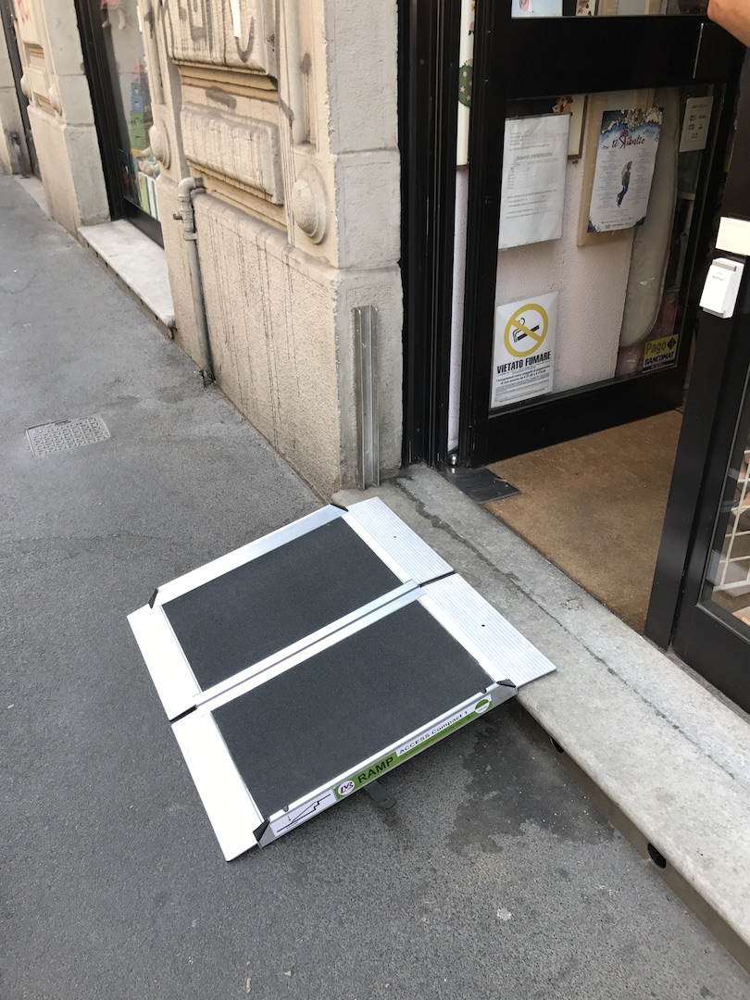
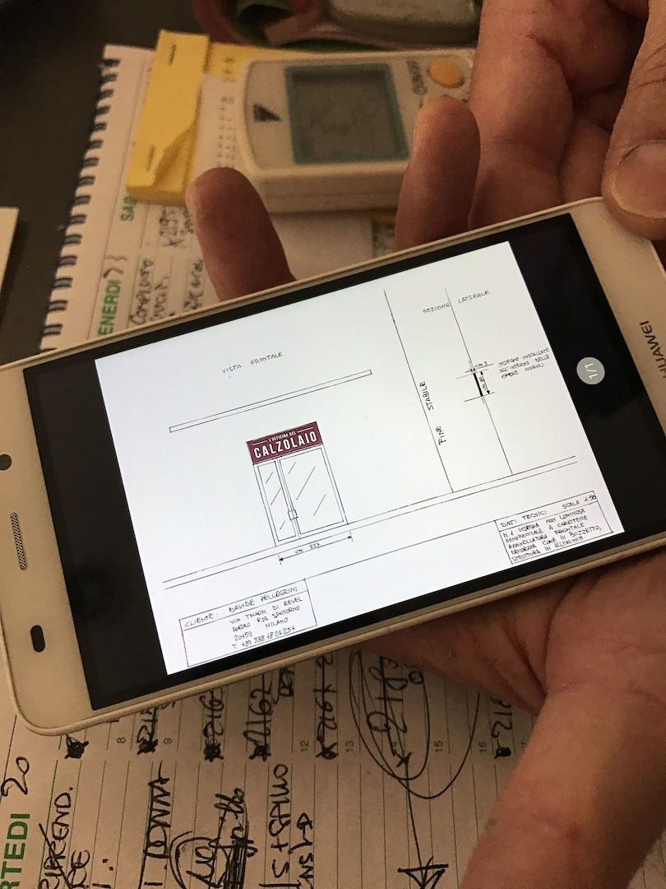

Ciao, ecco un aggiornamento sulla seconda parte del progetto open rampette: la procedura.

Ormai dovreste avere una certa familiarità con Dioniso e Minerva (Dioniso rappresenta i desideri e le necessita’ di persone con mobilità ridotta che vogliono entrare in un negozio, mentre Minerva rappresenta tutti i proprietari di negozi che vogliono accogliere chiunque nei loro negozi).

Dioniso potrebbe chiedersi cosa stia facendo Minerva per rendere il suo spazio accessibile a tutti mentre i nostri progettisti a WeMake stanno lavorando duramente su soluzioni tecnologiche per risolvere il processo di chiamata.
Purtroppo Minerva non può solamente acquistare una rampa e un campanello, ma deve seguire una procedura burocratica per fare in modo che il Comune di Milano possa verificare:
- Che le dimensioni e gli attributi della rampa siano corretti
- Se è possibile posizionare la rampa davanti al negozio senza compromettere l'uso del marciapiede
- E regolamenti più specifici ...

La procedura non è esattamente semplice da seguire, quindi abbiamo organizzato un incontro pubblico dove abbiamo chiesto agli esercenti del quartiere Isola di Milano (le nostre Minerva) di provare a completare la procedura sotto i nostri occhi, come si può vedere dal post di follow-up a questo [link](https://edgeryders.eu/en/open-rampette-la-procedura-incontro-2305-lastecca30).

Abbiamo ricevuto ottimi riscontri e informazioni che ci hanno portato alla preparazione di interviste per gli esercenti da svolgere direttamente nei loro negozi.

`“Non è chiaro quando sia necessario contattare un tecnico professionista…”
`
`“Informazioni difficili sono la misura della pedana, altezza e lunghezza e pendenze. Come le calcolo?”
`

Abbiamo inizialmente analizzato le varie situazioni specifiche di ogni esercizio commerciale e abbiamo chiesto informazioni come ad esempio:
- Come ha ricevuto l’informazione che si dovevi seguire una procedura di regolamentazione?
- Avete mai visto la procedura?
- Ha provato a seguire la procedura autonomamente o ha chiesto ad un professionista di fare il lavoro per Lei?
- Ha capito esattamente che cosa chiede la procedura ed è stato facile trovare questi dati?

Pianificare ed eseguire interviste è stato un lavoro piuttosto oneroso, ma è stato anche estremamente utile da una un punto di vista della progettazione. Ci ha aiutato a comprendere molte sfumature sui problemi degli esercenti alla comprensione e compilazione della procedura ed i loro bisogni, desideri e sensibilita’ nel risolvere il problema dell'accessibilità dei loro negozi.

`“Vogliamo far entrare chiunque nel nostro negozio, ci piacerebbe risolvere questo problema per le persone”`

`“Prima cerchiamo di risolvere autonomamente se non ci riusciamo ci facciamo supportare da qualcuno.”`

`“Se questo stesso modulo fosse possibile averlo online non solo da computer, magari sul sito del comune di milano, che ti possa dare questi risultati mettendo le misure, sarebbe il massimo.”`

Qui sotto si puo’ vedere un grafico che mostra gli argomenti che abbiamo coperto durante le interviste, in cui ognuna delle forme rappresenta il profilo di un esercente che abbiamo intervistato. Sovrapponendo le forme si possono vedere gli argomenti (dubbi, esigenze) che sono risultati più rilevanti (un livello piu’ alto di rilevanza verso l'esterno del grafico, un livello piu’ basso verso il centro).

<iframe src="https://drive.google.com/file/d/0B2Qw-X5Jj_X_LU44S0hHdDdBSTg/preview" width="640" height="480"></iframe>

Qui di seguito si puo’ invece vedere un altro grafico che ricostruisce il profilo di Minerva che inizialmente avevamo inventato. Aggiungendo le vere esigenze degli esercenti che abbiamo intervistato, finalmente abbiamo un profilo di Minerva realistico che possiamo utilizzare per progettare una procedura migliore!

[Figura del grafico di profilo]
<iframe src="https://drive.google.com/file/d/0B2Qw-X5Jj_X_ZjFmZnBWVjhXRmc/preview" width="640" height="480"></iframe>

Perché questo lavoro è stato utile? Perché è solo grazie a questa conoscenza che possiamo procedere nella progettazione di uno strumento per facilitare il processo di regolarizzazione.
Al momento stiamo utilizzando tutte queste informazioni per creare un prototipo che verrà mostrato e testato pubblicamente a Milano il prossimo mercoledì 12 luglio.

Vi aspettiamo all’incontro per condividere con noi le vostre domande e dubbi, saranno estremamente utili e necessari per progettare una soluzione più adatta a voi.
