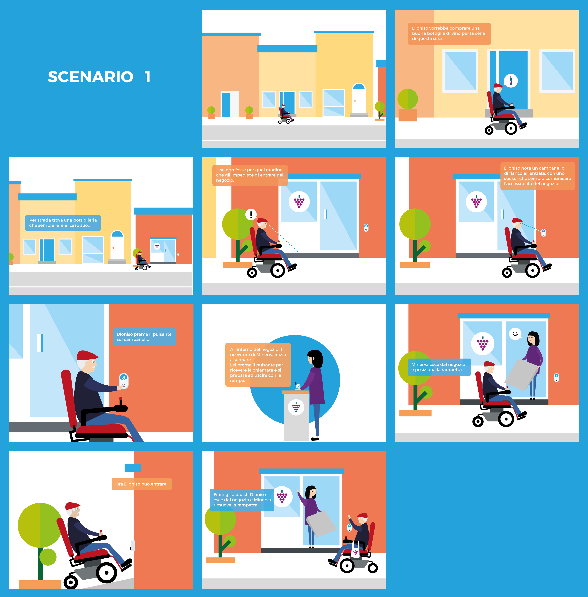

IT

Le soluzioni di chiamata proposte sono state progettate sulla base di una progettazione partecipara con le istituzioni, i negozianti ed i cittadini milanesi.
I dispositivi sono stati progettati sulle necessità specifiche della communità e sono già state testate sul campo presso alcuni negozi di Isola.

Per sapere di più riguardo alla metodologia di progetto ed i risultati della ricerca, puoi leggere:
- [incontro 11.05 @ LaStecca3.0 - La Chiamata]()

- [aggiornamento - brainstorming su possibili scenari futuri]()

### Prima iterazione

Analizzati i dati del quationario ci siamo buttati di testa a ipotizzare possibili soluzioni, e, in ottica maker abbiamo costruito 7 prototipi per far toccare con mano le soluzioni ai nostri interlocutori.

<iframe src="https://drive.google.com/file/d/0B2SJ8fygbNJmV09qcUJYNEFsS28/preview" width="800px" height="600px"></iframe>

Con dei prototipi in mano, ci siamo di nuovo confrontati con la community per capire quale delle soluzioni proposte poteva avere il potenziale di migliorare drasticamente l'esperienza di utilizzo della rampa temporanea. Raccolte le considerazioni di tutti abbiamo iniziato a lavorare sui dei prototipi più dettagliati.

### La soluzione proposta

La soluzione proposta è composta da tre parti:
1. Un campanello personalizzato con uno sticker che identifica il progetto: premendo il pulsante si richiede assistenza al negoziante.
2. Una app per smartphone che notifica la persona con disabilità motorie ogni volta che si trova nei pressi di un negozio accessibile e permette di richiedere assistenza (suonando il campanello) tramite smartphone.
3. Un ricevitore del campanello che notifica, con luce, suono o vibrazione, al negoziante la richiesta di assistenza.

### Scenario di utilizzo del campanello

### Scenario di utilizzo del campanello tramite app

### Istruzioni di assemblaggio

_(coming soon)_
